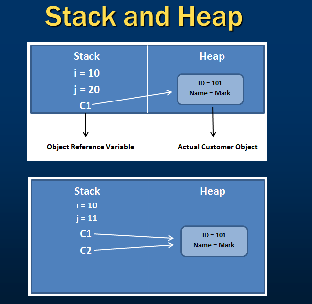

# DAY-029:

## Difference between classes and structs:

- A struct is a value type whereas a class is a reference type. All the differences that are applicable to value types and reference types are also applicable to classes and structs.

- Structs are stored on stack, whereas classes are stored on the heap.

    Value types hold their value in memory where they are declared, but reference types hold a reference to an object in memory.
    
    Value types are destroyed immediately after the scope is lost, whereas for reference types only the reference variable is destroyed after the scope is lost. The object is later destroyed by garbage collector.
    
    When you copy a struct into another struct, a new copy of that struct gets created and modifications on one struct will not affect the values contained by another struct.
    
    When you copy a class into another class, we only get a copy of the reference variables. Both the reference variables point to the same object on the heap. So, operations on one variable will affect the values contained by another reference variable.

- Structs can't have destructors, but classes can have destructors.

- Structs cannot have explicit parameter less constructor whereas a class can.

- Struct can't inherit from another class whereas a class can. Both structs and classes can inherit from an interface.

Examples of structs in the .NET framework - int(System.Int32), double(System.Double) etc.

*Note: A class or a struct cannot inherit from another struct. Structs are sealed types.*

*Note 2: How do you prevent a class from being inherited?*

Using a `sealed` keyword.

*Note 3: What is the significance of sealed keyword?*

It prevents the class from being inherit by another class.

## Stack and Heap:
