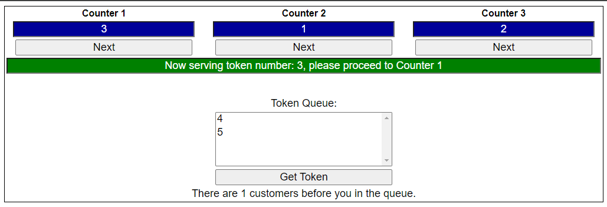

# DAY-084:

## Real time example of Queue collection class:

When you walk into a DPS office, you will collect a token and wait in the queue for your token number to be called.

From the application perspective, when a token is issued, the token number will be added to the end of the queue.

When a representative at the counter is available to serve a customer, s/he will push the "Next" button and the token number that is present at the beginning of the queue will be dequeued.

So, this is an example where a Queue collection class can be effectively used.

