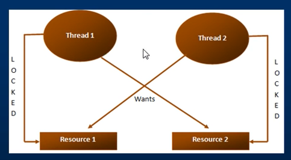

# DAY-095:

## Deadlock in a multithreaded program:

### When can a deadlock can?

Let us say we have two threads
- Thread 1, and
- Thread 2

and two resources:
- Resource 1, and
- Resource 2

Thread 1 has already acquired a lock on Resource 1 and wants to acquire a lock on Resource 2. At the same time, Thread 2 has already acquired lock on Resource 2 and wants to acquire a lock on Resource 1.

But the two threads never give up their locks, hence a `deadlock`.